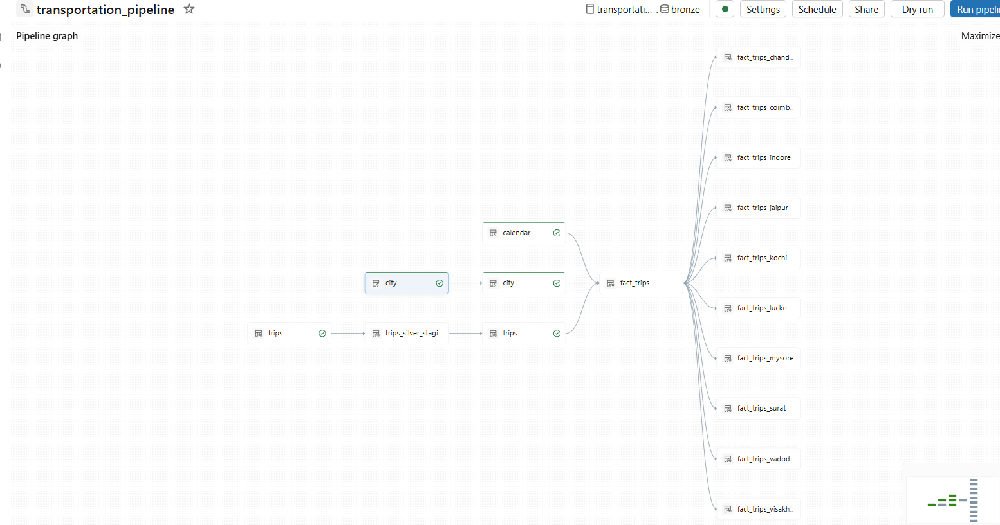
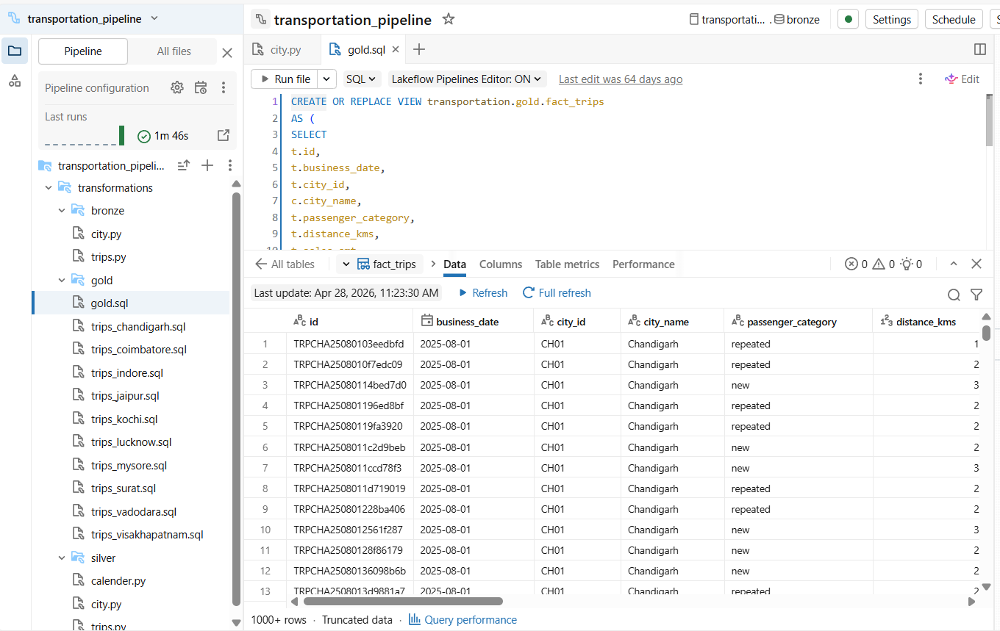

# 🚀 Transportation Data Pipeline (Databricks + Apache Spark)

## 📌 Overview
This project implements an end-to-end data engineering pipeline using Databricks Lakeflow and Apache Spark. It processes transportation data using both batch and streaming approaches while following the Medallion Architecture (Bronze, Silver, Gold).

The pipeline is designed to be scalable, fault-tolerant, and supports incremental data processing using Delta Lake.

---

## 🏗️ Architecture

The pipeline follows a layered Medallion Architecture:

- **Bronze Layer** → Raw data ingestion (batch + streaming)
- **Silver Layer** → Data cleaning, validation, and transformation
- **Gold Layer** → Business-ready analytical datasets

---

## 🖼️ Pipeline Architecture

## 📊 Sample Data Output
Example of the final Gold layer (`fact_trips`) after transformations:

---

## ⚙️ Tech Stack

- Databricks Lakeflow Pipelines  
- Apache Spark (PySpark, Spark SQL)  
- Delta Lake  
- AWS S3  
- Auto Loader (cloudFiles)  

---

## 🔄 Key Features

### 🔹 Batch + Streaming Processing
- Batch ingestion for static data (City)
- Streaming ingestion for transactional data (Trips)

### 🔹 Incremental Processing
- Implemented Change Data Capture (CDC)
- Used Delta Lake Change Data Feed (CDF) for efficient updates

### 🔹 Auto Loader
- Automatically detects new files from cloud storage
- Handles schema evolution using rescue mode

### 🔹 Data Transformation
- Data cleaning and validation in Silver layer
- Standardized schema across datasets

### 🔹 Data Modeling
- Designed fact and dimension tables
- Built analytical datasets for reporting

---

## 🔁 Pipeline Flow

1. Ingest raw data from AWS S3 (Bronze layer)
2. Process and clean data (Silver layer)
3. Apply CDC and transformations
4. Build fact tables using SQL joins (Gold layer)
5. Generate city-specific analytical views

---

## 📊 Outcome

- Scalable and maintainable data pipeline
- Supports both batch and real-time processing
- Optimized using incremental processing (no full reloads)
- Ready for BI dashboards and analytics

---

## 📁 Project Structure
bronze/
silver/
gold/
images/
README.md

---

## 📌 Note

This project demonstrates real-world data engineering practices using Databricks Lakehouse architecture and declarative pipelines.